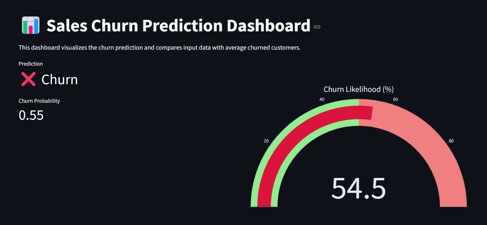
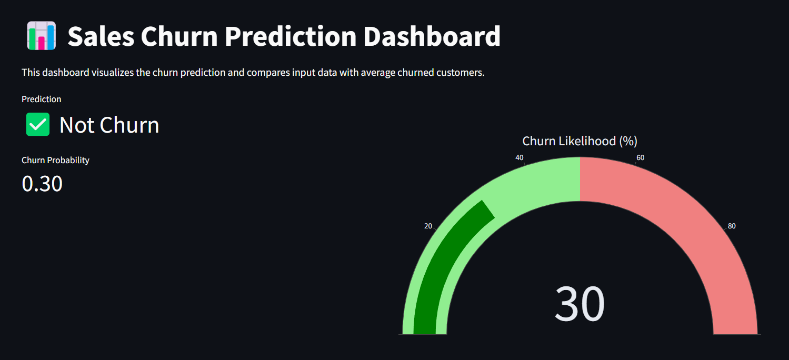
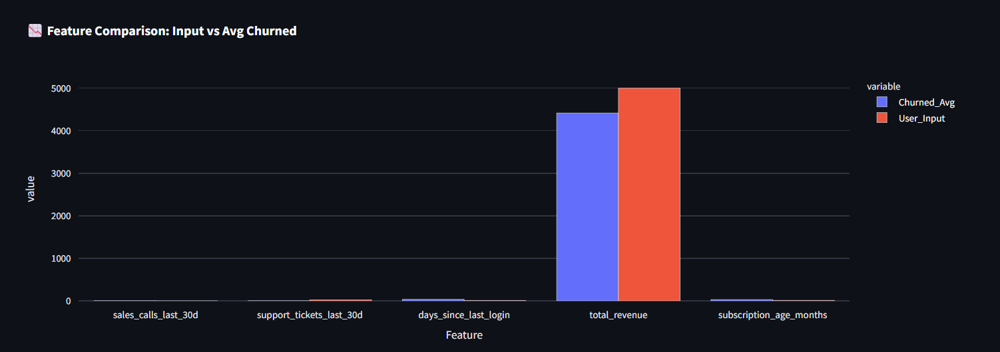
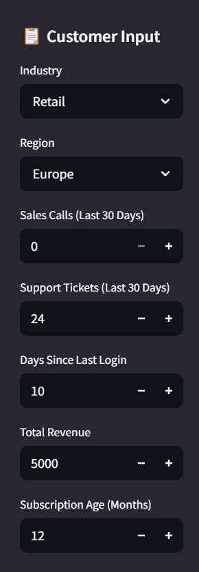

# 📉 Sales Churn Prediction Dashboard

An interactive, real-time machine learning dashboard for predicting customer churn in a sales environment. This project features a Streamlit UI, trained Logistic Regression model, and visual comparison against churned customer data for decision support.

---

## 🚀 Features

### 🔍 Machine Learning
- Logistic Regression trained on customer activity features
- Predicts binary churn outcome (churn / not churn)
- Probability score included for decision confidence

### 📊 Streamlit Dashboard
- Clean UI with sidebar inputs
- Gauge chart for churn probability
- Bar chart comparing user input with average churned customers
- Dark theme styling with real-time prediction output

---

## 📂 Project Structure

```
Sales_Churn_Prediction/
├── app.py                     # Streamlit dashboard
├── churn_model.pkl            # Trained Logistic Regression model
├── sales_churn_data.csv       # Historical churn dataset
├── train_churn_model.py       # Model training script
├── requirements.txt           # Python dependencies
├── README.md                  # Project overview
```

---

## 🧪 Tech Stack

- **Modeling**: Scikit-learn (Logistic Regression)
- **Dashboard**: Streamlit
- **Visualization**: Plotly (gauge + bar chart)
- **Data Handling**: Pandas, NumPy

---

## ⚙️ Setup Instructions

### 1. Clone the Repository
```bash
git clone https://github.com/<your-username>/Sales_Churn_Prediction.git
cd Sales_Churn_Prediction
```

### 2. Create and Activate a Virtual Environment
```bash
python -m venv .venv
source .venv/bin/activate  # or .venv\Scripts\activate on Windows
```

### 3. Install Dependencies
```bash
pip install -r requirements.txt
```

### 4. Train the Model (Optional)
```bash
python train_churn_model.py
```

---

## ▶️ Run the Dashboard

```bash
streamlit run app.py
```

Access it at [http://localhost:8501](http://localhost:8501)

---

## 🌐 Deployment

### Deploy on Streamlit Cloud
1. Push the repo to GitHub.
2. Go to [https://share.streamlit.io](https://share.streamlit.io)
3. Connect your repo and choose `app.py`
4. It will auto-install from `requirements.txt` and deploy.

---

## 📷 Dashboard Screenshots

### 🧠 Churn Prediction Output (Churned)


### 🌿 Churn Prediction Output (Not Churned)


### 🔄 Feature Comparison Chart


### 📄 Sidebar Input Panel



---

## 📄 Data Insights

- The dashboard uses `sales_churn_data.csv` to compute mean values of churned customers.
- Prediction is made based on five features:
  - Sales Calls (last 30 days)
  - Support Tickets (last 30 days)
  - Days Since Last Login
  - Total Revenue
  - Subscription Age (months)

---

## 🤝 Author & Credits

**Sahran Altaf**  
Data Science & Robotics @ Symbiosis Institute of Technology  
GitHub: [DarSahran](https://github.com/DarSahran)

---

## 📜 License

MIT License — free to use, modify, and share.